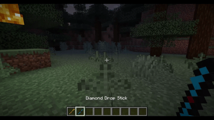
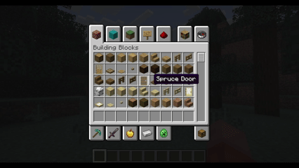
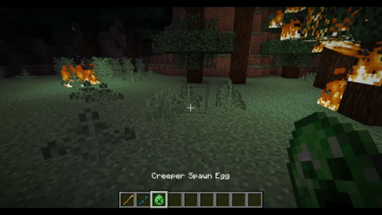

# Design1: Minecraft Mod 


I made a mod for Minecraft 1.21.10 using Fabric. It adds three items: Suspicious Substance, Lightning Stick, and Diamond Drop Stick.
The Suspicious Substance and Lightning Stick were tutorial items from the [Fabric](https://docs.fabricmc.net/1.21.1/develop/items/first-item) documentation and I added the Diamond Drop Stick on my own.

### Item Functionality
- `Lightning Stick`: Strikes lightning 10 blocks in front of the player when they right-click while holding the `Lightning Stick` 
- `Diamond Drop Stick`: Drops a Diamond in front of the player when they right-click while holding the `Diamond Drop Stick`
- `Suspicious Substance`: does nothing

## Requirements

- JDK 21
- I used IntelliJ IDEA IDE
- Minecraft Java Edition 1.21.10

## Run & Test the Mod

On Windows, open a terminal in the project folder and run:

```powershell
.\gradlew.bat runClient
```

This will launch Minecraft client with the mod loaded. The first run may take a while, because
Gradle will download Minecraft. 

### On launch
- Create a new world on creative 
- Open the creative menu
- Navigate to the `Ingredients` Tab
- Scroll to the bottom
- You should find all 3 added items




- Try out the functionality Lightning and Diamond Drop Sticks
- Put one in your hand and right click!
- [Cool interactions with lighting to try out](https://www.sportskeeda.com/minecraft/how-lightning-affect-mobs-minecraft)


## What I learned

- I learned how to set  up a project to make a Minecraft Mod with fabric
- How to add new items and give them functionality in Minecraft
- Basics of writing Markdown
## Item resources

The two Stick items have a texture obtained from this [link](https://minecraft.novaskin.me/post/979223242/stick-16x16) 
that I colored in Paint. and the Suspicious Substance was obtained from the first item fabric tutorial linked below
## Documentation

I used the first-item guide from the fabric documentation which is for Minecraft 1.21.1.The concepts were useful, 
but the code and resources were slightly different because of the Minecraft version.

- [Fabric: Creating a project](https://docs.fabricmc.net/develop/getting-started/creating-a-project)
- [Fabric: Creating your first item (1.21.1)](https://docs.fabricmc.net/1.21.1/develop/items/first-item)
- [Fabric: Creating your first item (current documentation)](https://docs.fabricmc.net/develop/items/first-item)
- [YouTube: How to make minecraft mods in 2026!](https://youtu.be/83EnEPk3N58)
- [Fabric: Template](https://fabricmc.net/develop/template/)
- [Markdown](https://www.markdownguide.org/basic-syntax/)